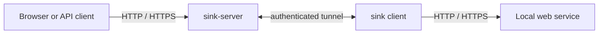

# sink

Sink is a self-hosted reverse tunnel for HTTP and HTTPS. Run the `sink` client
beside a local web service, and `sink-server` makes it available at a generated
or chosen subdomain of your own domain with Sink-managed TLS.

Sink streams request and response bodies without buffering them in full. It
supports large transfers, SSE, WebSockets, concurrent requests, reconnecting
with the same public address, and bearer-token accounts. The client also has a
built-in traffic inspector for viewing and replaying requests while a tunnel is
running.

## How it fits together



The client opens the tunnel as an outbound connection, so the local service
does not need a public port. `sink-server` accepts public traffic for the Sink
domain, terminates managed TLS, and carries traffic over the authenticated
tunnel. See [architecture](docs/architecture.md), the
[security model](docs/security-model.md), and the
[server deployment reference](docs/server-reference.md).

## Install

Download the [latest release](https://github.com/ptrstovka/sink/releases) for
macOS or Linux on arm64 or x86_64. Releases contain both `sink` and
`sink-server`, checksums, and signed and notarized macOS executables. A
multi-platform server image is available at `ghcr.io/ptrstovka/sink-server`.

Run `sink update` to update the client. Update `sink-server` separately.

[Get Sink running](docs/getting-started.md) installs both programs and opens the
first tunnel. Use the [server deployment reference](docs/server-reference.md)
and [client reference](docs/client-reference.md) for the remaining options.

## Quick client use

```console
sink config add-server-addr https://connect.example.com
sink config add-authtoken TOKEN
sink http 3000
sink http 3000 --url https://demo.example.com
```

Targets may also be `host:port`, `http://...`, or `https://...`. The control
connection and local HTTPS targets validate certificates by default.

For cross-origin assets, use `--cors-allow-origin https://other.example.com`
or `--cors-allow-origin '*'`. Credentialed requests additionally require
`--cors-allow-credentials` and concrete origins. See the
[CORS reference](docs/client-reference.md#cross-origin-assets-and-requests).

Interactive `sink http` sessions check for client updates once a day. Set
`SINK_NO_UPDATE_CHECK=1` to disable the automatic check; `sink update` remains
available for manual updates.

The inspector is enabled by default. `sink` prints a URL such as
`http://127.0.0.1:4040`. Use `--inspect=false` to disable it or
`--dashboard-port PORT` to choose its loopback port. See the
[client reference](docs/client-reference.md) for inspector behavior and the
[security model](docs/security-model.md) before revealing or exporting secrets.

## Quick server use

```console
sink-server serve --public-base-domain example.com
sink-server user create me
sink-server user list
sink-server user rotate-token me
sink-server user disable me
sink-server user enable me
```

The [CLI reference](docs/cli-reference.md) summarizes the available commands
and settings. Advanced deployments can opt into raw TLS passthrough and PROXY
protocol support; configuration and trust requirements are covered in the
[client reference](docs/client-reference.md) and
[server deployment reference](docs/server-reference.md).

## Limits and license

Review the [deployment boundaries](docs/deployment-boundaries.md) when planning
a non-standard topology. Sink is available under the [MIT](LICENSE) license.
