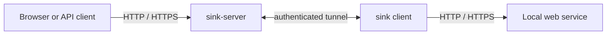

# Architecture

Sink uses two executables:

`sink-server` accepts public HTTP and HTTPS traffic for the configured domain.
It terminates managed TLS and forwards each request over a tunnel opened by the
client. Because the client connection is outbound, the local service needs no
public listener or inbound firewall rule.

The reserved `connect.<base-domain>` route uses an authenticated, versioned
WebSocket connection. The upgraded byte stream carries yamux, allowing many
independent requests and upgraded connections to share one client session.

Each public HTTP request or upgraded connection gets an independent yamux
stream and HTTP/1.1 exchange to the client. The client proxies that exchange to
the configured local HTTP or HTTPS target. Independent streams provide
concurrency and backpressure while allowing bodies, SSE, and WebSockets to flow
without whole-body buffering.

## Routes and namespaces

Generated and chosen tunnel names are runtime route leases. A clean client exit
releases its route; an unexpected disconnect retains it briefly so the same run
can reconnect without changing its public URL. A newer control connection from
that run replaces an older half-open connection. Interrupted in-flight traffic
fails and is never replayed automatically.

Persistent namespace claims are separate resources. A managed claim authorizes
its apex and one wildcard certificate. Only the adjacent parent owner may
create a nested claim, and the configured maximum depth bounds persistent
claims. Certificate issuance happens when a managed claim is created, not when
a tunnel starts. System names such as `connect` remain reserved.

Raw TLS passthrough is an advanced namespace mode. A passthrough route sends
ordinary HTTP traffic to its HTTP target and untouched TLS streams to its TCP
target. The local TLS service owns the certificate and handshake. Passthrough
routes fail closed while their client is unavailable and never fall back to a
managed certificate or another route.

## Persistent and runtime state

SQLite stores accounts, token digests and revisions, persistent namespace
claims, ACME state, and certificate material. Active tunnel routes remain
runtime leases rather than permanent reservations. Account disable or token
rotation closes active sessions after a short revocation check.

With managed TLS enabled, startup reconciles certificate orders, provisions or
reuses the base-domain certificate, and loads namespace authorization before
either listener accepts traffic. Base-certificate failure prevents startup. The
certificate lifecycle continues after readiness and drains with both listeners
during graceful shutdown.

Forwarding preserves the method, path, query, body, status, and end-to-end
headers. The local Host targets the local service; standard forwarding headers
carry the public host, scheme, and observed visitor address. Control credentials
never enter the forwarded HTTP exchange.

When Sink listens directly, the accepted socket is the network trust boundary.
An optional TCP proxy can provide source and destination addresses through
peer-restricted PROXY v2 on the HTTPS listener. Sink validates that metadata
before carrying it through the authenticated tunnel. If a passthrough route
requests outgoing PROXY v2, the client constructs a new header rather than
copying untrusted bytes or inbound TLVs.

## Local traffic inspector

Inspection is a client-side branch of the streaming proxy, not a hop in the
forwarding path. It stores bounded request and response previews in process
memory and publishes updates without backpressuring tunneled traffic.

The store retains at most 100 transactions and 1 MiB from each request or
response body by default. Oldest entries are evicted. Full transferred byte
counts remain available when a preview is truncated, and binary body bytes are
omitted.

The dashboard listens only on IPv4 loopback and is supervised separately from
the tunnel connection. Its assets are embedded in the `sink` executable, so an
installed client does not need a separate dashboard service.
